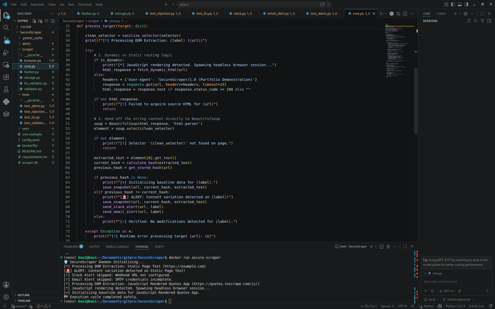
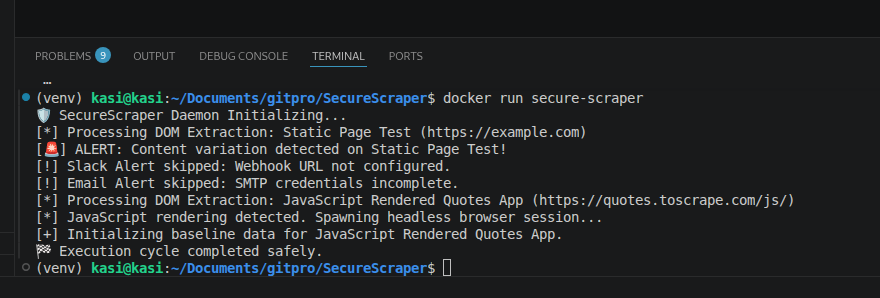

# SecureScraper



A production-grade, containerized security monitoring daemon designed to securely fetch, validate, and track DOM mutations across static and dynamic (JavaScript-rendered) web architecture. SecureScraper implements cryptographic fingerprinting, low-level pre-flight network validation, and strict input sanitization to proactively mitigate common application-layer security vectors (OWASP Top 10).

---

## 🏗️ Architectural Overview

SecureScraper operates as an isolated execution cycle that runs pre-flight security checks before ever instantiating data parsing modules.

* **Static Routing:** Utilizes `requests` and `BeautifulSoup4` for low-overhead extraction of static assets.
* **Dynamic Routing:** Leverages an automated headless browser pipeline via **Playwright** to execute scripts, resolve framework dependencies (React/Vue/Angular), and process Single Page Applications (SPAs).
* **Cryptographic Layer:** Converts targeted DOM element states into **SHA-256 signatures** compared against a relational SQLite persistence layer to detect real-time changes without storing massive data baselines.

---

## 🛡️ Defensible Security Architecture (OWASP Top 10 Mitigation)

SecureScraper was engineered with a security-first posture, enforcing defensive code gates across every system boundary:

### 1. Pre-Flight TLS Certificate Validation (Network Security Focus)
Before a connection is initialized, the daemon bypasses standard client abstractions to establish a low-level secure socket handshake (`ssl` + `socket`). 
* **Protocol Enforcement:** Hard-locks connections to a secure minimum of **TLS 1.2 or TLS 1.3**, rejecting deprecated/insecure protocols (SSLv3, TLS 1.0, TLS 1.1).
* **Expiration Boundary Protection:** Inspects the certificate's `notAfter` payload. The pipeline actively drops the target cycle and logs a security block if the certificate is expired or drops below a configurable expiration safety buffer (Default: 7 days).
* **MitM Protection:** Captures explicit `SSLCertVerificationError` exceptions to detect fraudulent certificates, untrusted Certificate Authorities (CAs), or active downgrade/Man-in-the-Middle attacks.

### 2. Input Validation Gate (Anti-SSRF & Path Injection)
* Regulated URL checking blocks non-standard schema interactions, strictly whitelisting `http://` and `https://` requests to eliminate Server-Side Request Forgery (SSRF) and local file inclusion (`file://`).
* CSS Selectors are parsed and sanitized through alphanumeric regex boundaries to prevent command injection parameters from bleeding into structural processing queries.

### 3. Secure Persistence Layer (Anti-SQLi & XSS)
* **SQL Injection Mitigation:** The storage layer utilizes strictly **parameterized SQL queries** via Python’s `sqlite3` engine. Raw variables are never concatenated into database commands.
* **Stored XSS Protection:** Extracted DOM textual components are systematically scrubbed through standard escaping rules before database state updates to prevent stored cross-site scripting strings from persisting inside data fields.

---

## ⚙️ Automated Integration Stack (Dockerization)

The platform is fully containerized, relying on a multi-stage operating system layout to safely handle headless browser threads without manual configuration dependencies.

### Local Execution Workflow:

**1. Clean Compilation (Bypassing Layer Cache):**
```bash
docker build --no-cache -t secure-scraper .
\`\`\`


